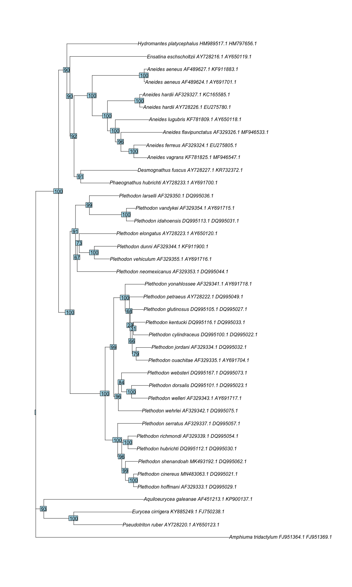

Phylogenetic Biology - Final Project
====================================

Guidelines - you can delete this section before submission
----------------------------------------------------------

This repository is a stub for your final project. Fork it, develop your
project, and submit it as a pull request. Edit/ delete the text in this
readme as needed.

Some guidelines and tips:

-   Use the stubs below to write up your final project. Alternatively,
    if you would like the writeup to be an executable document (with
    [knitr](http://yihui.name/knitr/), [jupytr](http://jupyter.org/), or
    other tools), you can create it as a separate file and put a link to
    it here in the readme.

-   For information on formatting text files with markdown, see
    <a href="https://guides.github.com/features/mastering-markdown/" class="uri">https://guides.github.com/features/mastering-markdown/</a>
    . You can use markdown to include images in this document by linking
    to files in the repository, eg ``.

-   The project must be entirely reproducible. In addition to the
    results, the repository must include all the data (or links to data)
    and code needed to reproduce the results.

-   If you are working with unpublished data that you would prefer not
    to publicly share at this time, please contact me to discuss
    options. In most cases, the data can be anonymized in a way that
    putting them in a public repo does not compromise your other goals.

-   Paste references (including urls) into the reference section, and
    cite them with the general format (Smith at al. 2003).

-   Commit and push often as you work.

OK, here we go.

Crossing America: Phylogenetics of Two Plethodontid Salamander Genera Across Their Highly Fragmented Ranges
===========================================================================================================

Introduction and Goals
----------------------

Plethodontidae is a diverse group of salamanders with most of their
diversity located in North America, specifically east of the Great
Plains in the United States, along the West Coast of the United States,
and in the mountainous ranges of central and southern Mexico
(AmphibiaWeb 2020). Members of Plethodontidae are lungless, and depend
on moist conditions to survive; this combined with their small size
(most species reach under 15 cm in length) greatly constrains their
ability to disperse over large distances. Two genera,
*A**n**e**i**d**e**s* and *P**l**e**t**h**o**d**o**n*, have
representatives both on the West Coast and east of the Great Plains,
regions which are seperated by wide expanses of dry, highly unsuitable
habitat for Plethodontids. Even more surprisingly, a single species in
each genus is also present in isolated mountain ranges in New Mexico
(*A**n**e**i**d**e**s* *h**a**r**d**i**i* and
*P**l**e**t**h**o**d**o**n* *n**e**o**m**e**x**i**c**a**n**u**s*);
similar, seemingly-suitable habitat is present in other nearby mountain
ranges in New Mexico, and much more extensively in the Colorado Rockies
to the north and the Sierra Madre Occidental to the southwest, yet
neither genus has been documented in these areas in spite of extensive
collecting by herpetologists (Petranka 2010).
*P**l**e**t**h**o**d**o**n* and *A**n**e**i**d**e**s* are each believed
to be monophyletic, and they are not believed to be sister taxa (Vieites
et al. 2011), yet no other genus in Plethodontidae is present in more
than one of the three hotspots described above (eastern US, West Coast,
southern/central Mexico), and no Plethodontids at all are found west of
central Texas and the Great Plains, and east of the Great Basin and the
Idaho Rockies, besides the aforementioned two species (Petranka 2010).
The goal of my project is to better understand the evolutionary history
of these two oddly-distributed genera. Specifically, I would like to
verify that Aneides and Plethodon are truly each monophyletic as they
are currently understood to be, and if they are, I would like to
understand how each genus expanded across North America, by examining
the phylogenetic relationships between the eastern, western, and New
Mexican representatives of each genus. This would provide insight as to
whether the New Mexican species are each relics of a more widespread
distribution of Plethodontids across North America, or whether they
represent radiations from either coast.

Methods
-------

I obtained publicly-available DNA sequences for two genes, ND-4
(mitochondrial) and Rag-1 (nuclear) from the NCBI database for
*A**n**e**i**d**e**s* *h**a**r**d**i**i*,
*P**l**e**t**h**o**d**o**n* *n**e**o**m**e**x**i**c**a**n**u**s*,
several representatives of each of *A**n**e**i**d**e**s* and
*P**l**e**t**h**o**d**o**n* from both their eastern and western
distributions, a number of outgroups within Plethodontidae including
species which range relatively far north in Mexico
(*A**q**u**i**l**o**e**u**r**y**c**e**a* *g**a**l**e**a**n**a**e*,
*I**s**t**h**m**u**r**a* *b**e**l**l**i**i*), and one outgroup from
outside of Plethodontidae
(*A**m**p**h**i**u**m**a* *t**r**i**d**a**c**t**y**l**u**m*). I created
a maximum-likelihood gene tree for each of these genes using IQ-TREE,
with a bootstrap sample of 1000 to generate support values. I also
generated a third tree by inputting the direct concatenation of these
two genes into IQ-TREE with the specifications described above.

Results
-------

Below is the gene tree generated for the ND-4 gene.

Below is the gene tree generated for the Rag-1 gene.

Finally, below is the gene tree generated for the concatenation of the
two genes.

Discussion
----------

This phylogeny places Plethodon neomexicanus as nested within the clade
of western Plethodon. This would suggest that Plethodon neomexicanus
arose in its current distribution as a result of a radiation from the
northwestern United States that occurred after (and seperately from) the
dispersal event of Plethodon from one coast to the other. The phylogeny
places Aneides hardii as sister to all western Aneides species, with
Aneides aeneus, the one eastern Aneides sampled, placed as sister to all
other Aneides. This suggests that Aneides hardii is the product of a
radiation from the west coast that occurred after the split between
Aneides aeneus and the western members of Aneides. In short, this
preliminary analysis suggests that neither species is the relic of the
dispersal event which allowed each of the two genera to exist on both
coasts. The topology of small subclades of the tree close to the tips
pretty closely matches that of published phylogenies of Plethodontidae
(e.g. <a href="http://ibdev.mcb.berkeley.edu/labs/wake/373_multigenic_Plethodontidae.pdf" class="uri">http://ibdev.mcb.berkeley.edu/labs/wake/373_multigenic_Plethodontidae.pdf</a>
and
<a href="https://www.researchgate.net/figure/Combined-data-Plethodon-phylogeny-Phylogeny-of-the-salamander-genus-Plethodon-based-on-a_fig1_51717349" class="uri">https://www.researchgate.net/figure/Combined-data-Plethodon-phylogeny-Phylogeny-of-the-salamander-genus-Plethodon-based-on-a_fig1_51717349</a>),
meaning that it’s placement of Plethodon neomexicanus and Aneides hardii
within the western clade of Plethodon and within Aneides respectively
may be trusted to some degree.

This phylogeny also suggests, more controversially, that the genus
Plethodon is paraphyletic, with all eastern Plethodon falling in a clade
that is sister to a large portion of Plethodontidae, including genera
limited to the east coast (Desmognathus, Phaeognathus, Eurycea,
Pseudotriton), the west coast (Hydromantes), and Mexico and Central
America (Isthamura, Aquiloeurycea). According to this result, there was
no radiation of the genus Plethodon across the United States; instead,
there was a divergence between eastern Plethodon and most other
Plethodontids, which some of the genera in the remaining clade
dispersing across the United States or into Mexico. This not only seem
less believable becuase it would require several independent massive
dispresal events across varied habitat and large distances, but it also
goes against published family-level phylogenies of Plethodontidae. I
suspect that \~800 base pairs is not sufficient to work out the order of
the ancient and rapid series of divergences which resulted in the
present-day (genus-level, if we are to belive current taxonomy)
diversity of Plethodontidae. Going forward, I will search for more genes
for which there is available data for Plethodon neomexicanus and Aneides
hardii, preferably with many more base pairs, in order to construct a
more certain phylogeny. I will also think about how I could make more
concious choices about the model I use to gain more reliable results.

These results indicate…

The biggest difficulty in implementing these analyses was…

If I did these analyses again, I would…

References
----------

AmphibiaWeb. 2020.
<a href="https://amphibiaweb.org" class="uri">https://amphibiaweb.org</a>
University of California, Berkeley, CA, USA. Accessed 30 Nov 2020.

B.Q. Minh, H.A. Schmidt, O. Chernomor, D. Schrempf, M.D. Woodhams, A.
von Haeseler, R. Lanfear (2020) IQ-TREE 2: New models and efficient
methods for phylogenetic inference in the genomic era. Mol. Biol. Evol.,
37:1530-1534.
<a href="https://doi.org/10.1093/molbev/msaa015" class="uri">https://doi.org/10.1093/molbev/msaa015</a>

Fisher-Reid, M. Caitlin. (2011). What are the consequences of combining
nuclear and mitochondrial data for phylogenetic analysis? Lessons from
Plethodon salamanders and 13 other vertebrate clades. BMC evolutionary
biology. 11. 300. 10.1186/1471-2148-11-300.

NCBI Resource Coordinators. Database resources of the National Center
for Biotechnology Information. Nucleic Acids Res. 2018 Jan
4;46(D1):D8-D13. doi: 10.1093/nar/gkx1095. PMID: 29140470; PMCID:
PMC5753372.

Petranka, James W. (2010). Salamanders of the United States and Canada.
Smithsonian Books. ISBN: 9781588343086

Vieites, David & Min, Mi-Sook & Wake, David. (2008). Rapid
diversification and dispersal during periods of global warming by
plethodontid salamanders. Proceedings of the National Academy of
Sciences of the United States of America. 104. 19903-7.
10.1073/pnas.0705056104.

Vieites, David & Nieto-Román, Sandra & Wake, Marvalee & Wake, David.
(2011). A multigenic perspective on phylogenetic relationships in the
largest family of salamanders, the Plethodontidae. Molecular
phylogenetics and evolution. 59. 623-35. 10.1016/j.ympev.2011.03.012.
